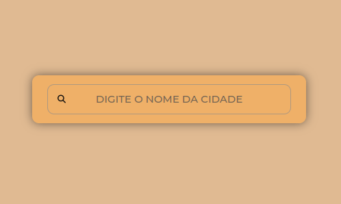

# Vai ter frizz?

### Confira a aplicação: [Deploy](https://lealvesrs.github.io/frizz-humidity/)

A falta de controle dos fios é uma situação vivenciada por todas as pessoas que têm o cabelo um pouquinho mais comprido, uma vez que ele é promovido pela baixa e alta umidade o ar. No entanto, o que para alguns é apenas uma condição capilar comum, para outros, é um motivo de incomodo e insegurança, principalmente frente a eventos importantes ou compromissos que requerem uma apresentação mais rigorosa.

Dessa forma, conseguimos com essa aplicação visualizar a umidade relativa do ar da localidade inserida a partir da API gratuita da [Open Weather](https://openweathermap.org/) e, assim, sabermos se _há ou não um indicativo para o frizz_.

A aplicação possui **três layouts** para cada uma das situações:
- Frizz provocado pela baixa umidade (<45%);
 

- Frizz provocado pela alta umidade (>60%);
 
 
- Sem frizz (entre 45% e 60%);
 

- Além de contar com um layout para lidar com as localidades inexistentes na base.
 

### Ferramentas e Tecnologias utilizadas
     
 
          
>  [Imagem](https://feirashop.com.br/beleza/frizz-em-dias-umido/) principal utilizada no design
